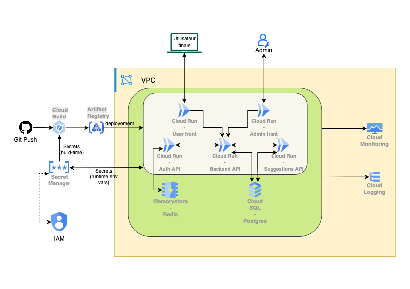

# twittix-infrastructure
## Serveur de pré-production

### objectifs :

- S'assurer de la bonne communication entre les micro-services dans un environnement maîtrisé.
-  S'assurer du bon fonctionnement de la CI/CD
- Environnement stable pour la CI 
- effectuer des tests pour la partie CD
- Économiser des coûts GCP en économisant des requêtes
- Liberté de débogage 
- Tests des performances


### Fonctionnement de l'infrastructure 

#### Schéma de l'infrastructure :


#### Fonctionnement concret :

- Github actions déploie automatiquement sur twittix 1, le master du node swarm.
- Les développeurs peuvent tester leurs fonctionnalités grâce à un tunnel SSH.

**exemple :**
Si on veut accéder au front, supposément exposé sur le port 8080 :

```bash
ssh -L 8080:localhost:8080 user@51.254.57.62 
```

puis, en tapant dans un navigateur :

```
http://localhost:8080/
```

- Si les modifications sont validées, on peut alors mettre en prod, en déployant ou mettant à jour l'infrastructure GCP avec Terraform.

## Infrastructure GCP 

### Objectifs :
- Déploiement de l'infrastructure GCP avec Terraform
- déploiement des micro services avec les Cloud Run

### Fonctionnement :
- La combinaison de Cloud Build et d'artifact registry permet de créer des images docker et de les stocker dans un registre privé. Directement issu de la CI/CD github.
- Le déploiement des mises à jour se fait automatiquement grâce à Cloud Build, qui va créer une image docker et la pousser dans le registre.
- Cloud Run permet de déployer les images docker sur un service serverless, sans avoir à gérer l'infrastructure.
- Le monitoring sera effectué avec Cloud Monitoring et Cloud Logging, qui permettent de suivre les performances et les logs des micro-services avec Cloud Logging.
- La gestion des secrets sera effectuée avec Secret Manager, qui permet de stocker les secrets de manière sécurisée et de les utiliser dans les micro-services.
- Les droits d'accès seront gérés avec IAM, qui permet de gérer les droits d'accès aux ressources GCP.
- Le réseau sera géré avec VPC, qui permet de créer un réseau virtuel privé et de gérer les sous-réseaux.

### Schéma de l'infrastructure GCP :
